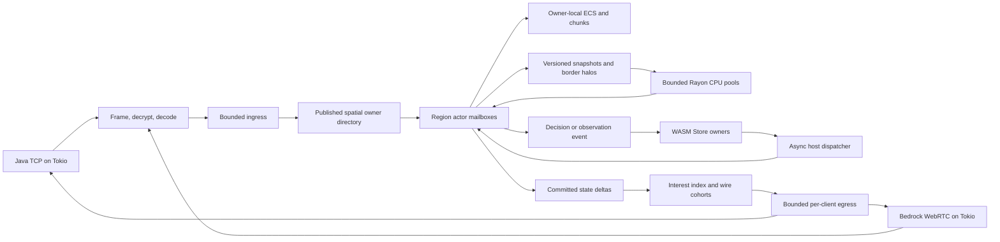

# System architecture and capacity contract

[Documentation index](../README.md) · [Spatial ownership and ECS](spatial-ownership-and-ecs.md) · [Networking](networking.md) · [Plugin pipeline](plugin-pipeline.md) · [Bottlenecks](bottlenecks.md)

## Objective and scope

The proposed architecture runs a continuous logical world in one Pumpkin process using Tokio for asynchronous I/O, Rayon for bounded CPU work, region actors for authoritative mutation, owner-local entity storage, and sandboxed WASM plugin execution. It avoids traditional proxy sharding and client reconnects between world fragments. It does not assume that one machine can satisfy arbitrary all-to-all player interactions.

The requested capacity envelope is **10,000+ concurrent players and tens of thousands of active entities**. This is a validation target. An eventual result must name the machine, NIC, edition mix, view and simulation distances, client movement pattern, active chunks, entity types, and plugin workload. An idle memory or startup-time figure does not predict memory, bandwidth, or tick performance at this scale.

## What exists in Pumpkin upstream

- A dedicated [ticker](../../crates/pumpkin/src/server/ticker.rs) drives the server tick. [World tick](../../crates/pumpkin/src/world/mod.rs) already uses Rayon for player, entity, block-entity, and other phases, but those phases are joined by the tick. This design should extend existing parallel work, not describe Pumpkin as fully single-threaded.
- World state includes `ArcSwap<Vec<Arc<dyn EntityBase>>>` and entity fields with independent synchronization. Active-chunk, collision, tracking, and broadcast paths have shared or broad-scan work. See [world](../../crates/pumpkin/src/world/mod.rs), [entity tracking](../../crates/pumpkin/src/world/entity_tracker.rs), and [entity types](../../crates/pumpkin/src/entity/mod.rs).
- The [Java decoder](../../crates/pumpkin-protocol/src/java/packet_decoder.rs) uses reusable byte storage and `Bytes` payloads. [Java broadcasts](../../crates/pumpkin/src/world/mod.rs) already share serialized payloads by protocol version; framing, compression, cipher state, and writes remain connection-specific. The [network implementation](../../crates/pumpkin/src/net/java/mod.rs) has per-client pending-byte limits but no aggregate memory budget.
- The [plugin manager](../../crates/pumpkin/src/plugin/mod.rs) awaits handlers. The WASM loader uses v0.1 bindings and a reentry gate attached to that loader. Cancellable movement and placement events must return a decision before their state changes. See [movement](../../crates/pumpkin/src/net/java/play/player_position.rs) and [block placement](../../crates/pumpkin/src/block/registry.rs).
- Upstream includes the [`pumpkin-scheduler` crate](../../crates/pumpkin-scheduler/src/lib.rs). Its [domain contract](../../crates/pumpkin-scheduler/src/domain.rs) names Global, World, Region, Entity, and External owners, while explicitly stating that only Global admission is implemented. The application crate does not yet use this scheduler; its existing [server task scheduler](../../crates/pumpkin/src/server/scheduler.rs) is a separate mechanism.
- The [README](../../README.md) marks Bedrock Edition as work in progress. The [Java admission configuration](../../crates/pumpkin-config/src/networking/java.rs) defaults to 1,000 players; raising that number alone does not create 10,000-player capacity.

## Current scaffold and proposed extension

The upstream scheduler crate provides bounded Global admission and a domain vocabulary; it does not yet schedule World, Region, or Entity work, and it is not wired into `pumpkin`. Upstream's current WASM host remains v0.1. This blueprint proposes integrating those boundaries, then extending them to region ownership and an asynchronous plugin contract. A manager-wide causal admission gate is one transitional compatibility design, not an existing upstream feature. The detailed migration and its throughput cost are in the [plugin pipeline](plugin-pipeline.md).

Folia is a useful comparator: it already merges and splits independently ticking regions. The proposal here additionally divides independent subsystem work *inside* a busy ownership domain, uses versioned snapshots for off-thread computation, and makes replication cost explicit. It cannot parallelize a genuinely serial gameplay dependency merely by making cells smaller. See [PaperMC's region logic](https://docs.papermc.io/folia/reference/region-logic/) and [overview](https://docs.papermc.io/folia/reference/overview/).

## Proposed data flow

Tokio tasks own sockets and asynchronous coordination. A region actor is a logical owner, not one operating-system thread per region. Rayon runs finite CPU jobs; it must not wait synchronously for a plugin or socket. A plugin request may suspend one transaction while the owner continues work that does not depend on that transaction. The [spatial design](spatial-ownership-and-ecs.md) defines ownership and handoff; the [plugin design](plugin-pipeline.md) defines the event boundary.

## Consistency contract

| Class | Operations | Rule |
| --- | --- | --- |
| Strict authoritative | Block placement, collision, combat, inventory, cancellable hooks | A single owner or coordinated interaction island commits in deterministic order. Do not drop or silently defer a required decision. |
| Versioned computation | AI planning, pathfinding, generation, most lighting | Run from immutable state; apply only if source versions and ownership generations still match. |
| Replaceable replication | Intermediate movement and cosmetic state | Coalesce under pressure and encode the next update against each recipient's last transmitted state. Preserve spawn/despawn and other required ordering. |

Cross-owner work uses owned commands, origin and sequence information, and explicit replies. A region never holds a world lock or `&mut` borrow across `.await`. An entity transfer invalidates its old generation before the new owner accepts commands. A border interaction that requires same-tick shared state is merged or otherwise explicitly coordinated; simply reading a stale halo is insufficient.

## Hotspot capacity arithmetic

For 500 moving players who can each see the other 499, one update each at 20 Hz requires `500 × 499 × 20 = 4,990,000` recipient deliveries per second. If the average delivered update were 100 bytes, that would be about 499 MB/s of payload before transport overhead and per-connection cryptography. Five hundred movers with 1,000 observers produce 10 million deliveries per second. Shared `Bytes` reduce encoding and memory copies, but cannot eliminate these deliveries.

The architecture therefore targets isolation of unrelated regions and bounded cost inside the hotspot. It cannot promise 50 ms ticks under arbitrary crowd size, plugin behavior, and hardware. The acceptance envelope and metrics are defined in [phase 00](../phases/00-baseline-and-benchmarks.md) and [phase 05](../phases/05-capacity-validation.md).

## Architectural decisions

1. **One owner for mutation:** use owner tokens and generation-checked commands instead of a world-wide write lock.
2. **No mandatory global tick barrier:** independently scheduled regions keep distant gameplay progressing when one region is expensive; global state changes are timestamped messages.
3. **CPU work uses immutable inputs:** preserve correctness by validating results at commit, and reserve CPU capacity for simulation over background work.
4. **Network sharing stops before encryption:** reuse identical protocol frames only for compatible recipients; each writer owns its cipher and socket.
5. **Plugin decisions are bounded:** preserve cancellation semantics while parking only the relevant transaction and enforcing a documented timeout policy.
6. **Capacity is measured:** the goal is accepted only with reproducible latency, correctness, memory, and bandwidth evidence.

The detailed execution order is [phase 01](../phases/01-spatial-index-and-networking.md), [phase 02](../phases/02-plugin-execution.md), [phase 03](../phases/03-region-ownership.md), [phase 04](../phases/04-ecs-migration.md), then [phase 05](../phases/05-capacity-validation.md).
