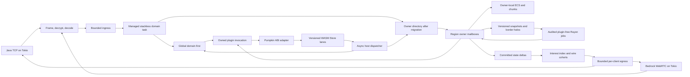

# System architecture and capacity contract

[Documentation index](../README.md) · [Spatial ownership and ECS](spatial-ownership-and-ecs.md) · [Networking](networking.md) · [Plugin pipeline](plugin-pipeline.md) · [Bottlenecks](bottlenecks.md)

## Objective and scope

Pumpkin already has useful foundations for a server that presents one continuous world: Tokio handles asynchronous I/O, and parts of world ticking run on Rayon. The proposal gives authoritative world mutation to spatial owners and starts plugin-capable work as managed stackless tasks before it can await a plugin. Rayon remains available for audited plugin-free CPU work. Plugin execution and network delivery have explicit admission boundaries. Players can move through the world without a proxy handoff or reconnect.

The capacity goal is **more than 10,000 concurrent players and tens of thousands of active entities**. It is a workload to validate, not a property inferred from Rust, idle memory use, or startup time. A credible result will identify the machine and NIC, Java and Bedrock mix, view and simulation distances, movement pattern, active chunks, entity types, and plugin workload. In particular, a crowd in which every player can see every other player creates network work that no choice of world scheduler can remove.

## What exists in Pumpkin upstream

The dedicated [ticker](../../crates/pumpkin/src/server/ticker.rs) drives a joined server tick. Within [world tick](../../crates/pumpkin/src/world/mod.rs), player, entity, block-entity, and other phases already use Rayon. The proposed scheduler therefore builds on existing parallel work while changing where the tick must wait for it. In the same world module, entities are held in an `ArcSwap<Vec<Arc<dyn EntityBase>>>`; individual [entity types](../../crates/pumpkin/src/entity/mod.rs) synchronize their own fields. Active-chunk, collision, [tracking](../../crates/pumpkin/src/world/entity_tracker.rs), and broadcast paths still contain shared work or broad scans.

The [Java decoder](../../crates/pumpkin-protocol/src/java/packet_decoder.rs) reuses byte storage and yields `Bytes` payloads. [Java broadcasts](../../crates/pumpkin/src/world/mod.rs) share serialized payloads by protocol version, while framing, compression, encryption, and writes remain connection-specific. The [network implementation](../../crates/pumpkin/src/net/java/mod.rs) limits pending bytes per client, but it has no aggregate egress memory budget.

The [plugin manager](../../crates/pumpkin/src/plugin/mod.rs) awaits event handlers. Its WASM loader uses v0.1 bindings and a reentry gate local to that loader. [Movement](../../crates/pumpkin/src/net/java/play/player_position.rs) and [block placement](../../crates/pumpkin/src/block/registry.rs) are cancellable, so their decisions have to be known before the corresponding state changes commit. Upstream also contains a [`pumpkin-scheduler` crate](../../crates/pumpkin-scheduler/src/lib.rs). Its [domain contract](../../crates/pumpkin-scheduler/src/domain.rs) names Global, World, Region, Entity, and External owners, and states that only Global admission is implemented. The application does not yet use that crate; its [server task scheduler](../../crates/pumpkin/src/server/scheduler.rs) serves a separate purpose.

The upstream [README](../../README.md) calls Bedrock Edition work in progress. The [Java admission configuration](../../crates/pumpkin-config/src/networking/java.rs) defaults to 1,000 players. That setting is an admission limit, so changing it does not by itself increase the server's processing capacity.

## Current scaffold and proposed extension

The scheduler crate's Global admission and domain vocabulary provide a starting point, but managed stackless task execution and application integration still need proof and implementation. The inspected upstream host remains at v0.1. A separate [fork proposal specifies `pumpkin:plugin@0.2.0` as a physically async WIT package](https://github.com/Phoenixxo/Pumpkin/blob/95fecc1b5969aa59dbb141f4c1090635f65ccd7e/crates/pumpkin-plugin-wit/v0.2/README.md); it does not supply the v0.2 host or scheduler integration. The proposed rollout first keeps v0.1 in a permanent, fair, graph-wide compatibility lane and brings plugin-capable roots into a stackless Global domain. The v0.2 Store path can then suspend and reenter without holding its caller's worker. World, Region, and Entity ownership follow in later stages without changing either plugin ABI. The [plugin pipeline](plugin-pipeline.md) defines these separate boundaries.

Folia is a useful comparator: it already merges and splits independently ticking regions. The proposal here additionally divides independent subsystem work *inside* a busy ownership domain, uses versioned snapshots for off-thread computation, and makes replication cost explicit. It cannot parallelize a genuinely serial gameplay dependency merely by making cells smaller. See [PaperMC's region logic](https://docs.papermc.io/folia/reference/region-logic/) and [overview](https://docs.papermc.io/folia/reference/overview/).

## Proposed data flow

Tokio tasks own sockets and asynchronous coordination. Pumpkin's adapter carries an opaque call chain from the plugin runtime and an execution domain from the scheduler; those generic crates do not depend on one another. A region actor represents exclusive authority over a part of the world, not a dedicated operating-system thread. Its plugin-capable root can return `Pending` while an owned invocation waits, releasing the scheduler worker. Rayon executes finite, plugin-free CPU jobs from immutable inputs and returns results for validation by the owner. The [spatial design](spatial-ownership-and-ecs.md) describes ownership and handoff; the [plugin design](plugin-pipeline.md) describes both ABI lanes and host dispatch.

## Consistency contract

| Class | Operations | Rule |
| --- | --- | --- |
| Strict authoritative | Block placement, collision, combat, inventory, and cancellable hooks. | A single owner or coordinated interaction island commits in deterministic order. A required decision is neither dropped nor silently deferred. |
| Versioned computation | AI planning, pathfinding, generation, and most lighting. | Jobs read immutable state; the owner applies a result only while its source versions and ownership generation still match. |
| Replaceable replication | Intermediate movement and cosmetic state. | Egress may coalesce intermediate updates under pressure and encode the next update against each recipient's last transmitted state. Spawn, despawn, and other required ordering remain intact. |

Cross-owner work uses owned commands, origin and sequence information, and explicit replies. A region never holds a world lock or `&mut` borrow across `.await`. An entity transfer invalidates its old generation before the new owner accepts commands. A border interaction that requires same-tick shared state is merged or otherwise explicitly coordinated; simply reading a stale halo is insufficient.

## Hotspot capacity arithmetic

For 500 moving players who can each see the other 499, one update each at 20 Hz requires `500 × 499 × 20 = 4,990,000` recipient deliveries per second. If the average delivered update were 100 bytes, that would be about 499 MB/s of payload before transport overhead and per-connection cryptography. Five hundred movers with 1,000 observers produce 10 million deliveries per second. Shared `Bytes` reduce encoding and memory copies, but cannot eliminate these deliveries.

The architecture therefore targets isolation of unrelated regions and bounded cost inside the hotspot. It cannot promise 50 ms ticks under arbitrary crowd size, plugin behavior, and hardware. The acceptance envelope and metrics are defined in [phase 00](../phases/00-baseline-and-benchmarks.md) and [phase 05](../phases/05-capacity-validation.md).

## Decisions that shape the implementation

Authoritative mutation belongs to one owner at a time. Commands carry an owner generation so a transfer can reject work addressed to the previous owner. Distant owners can tick independently after the Region stage; global changes arrive as timestamped messages rather than forcing every region through a common barrier. CPU jobs consume immutable snapshots, cannot enter plugins from unmanaged Rayon work, and return results whose source versions the owner checks before applying. The scheduler reserves capacity for simulation when generation, lighting, or other background jobs accumulate.

Network work can be shared while recipients have the same protocol representation. Each connection still owns its framing choices, cipher state, and socket, so sharing ends at the point where their wire bytes diverge. Plugin decisions preserve cancellation semantics with a bounded wait for the affected transaction and a documented failure policy. The 10,000-player target is accepted only when repeatable tests show its latency, correctness, memory, and bandwidth behavior under the named workload.

The detailed execution order is [phase 01](../phases/01-spatial-index-and-networking.md), [phase 02](../phases/02-plugin-execution.md), [phase 03](../phases/03-region-ownership.md), [phase 04](../phases/04-ecs-migration.md), then [phase 05](../phases/05-capacity-validation.md).
