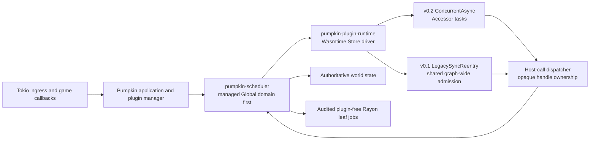
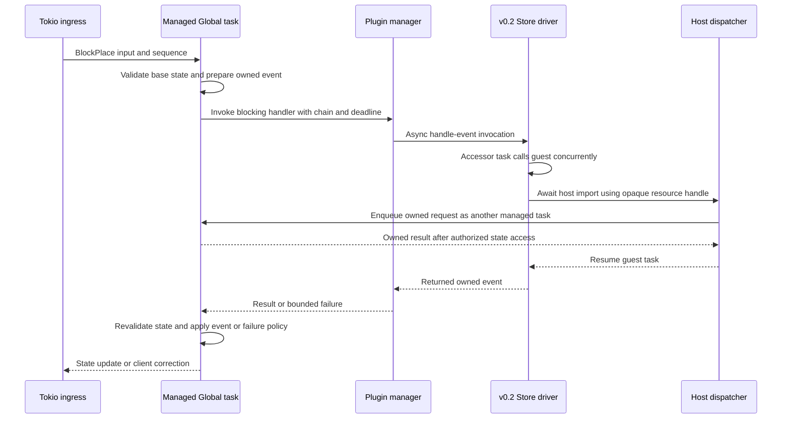

# Plugin execution across v0.1 and v0.2

Plugins can influence authoritative gameplay decisions, so Pumpkin has to let them wait for host work without holding a simulation worker or losing the meaning of a cancellable event. This chapter describes how the existing v0.1 compatibility path and the proposed v0.2 async path fit into one plugin manager. The baseline is Pumpkin upstream revision `4426d1113`; the v0.2 ABI is specified separately by the fork's [versioned WIT package](https://github.com/Phoenixxo/Pumpkin/blob/95fecc1b5969aa59dbb141f4c1090635f65ccd7e/crates/pumpkin-plugin-wit/v0.2/README.md) at commit `95fecc1b5`. That WIT package is a concrete proposal, while its v0.2 host integration and the execution policy described here are not behavior in the pinned upstream application. The [system overview](overview.md) places this boundary alongside [world ownership](spatial-ownership-and-ecs.md) and [networking](networking.md); [phase 02](../phases/02-plugin-execution.md) describes integration and validation.

## Current behavior and the compatibility requirement

The upstream [plugin manager](../../crates/pumpkin/src/plugin/mod.rs) awaits both its mutable/blocking and immutable/nonblocking handler groups. A nonblocking handler's event result is not applied, but its invocation is still part of the awaited dispatch. Synchronous callers use `fire_blocking`, which bridges into the asynchronous manager through `block_in_place` or `block_on`. The [WASM loader](../../crates/pumpkin/src/plugin/loader/wasm/mod.rs) uses `LegacySyncReentry`, and the [Store executor](../../crates/pumpkin-plugin-runtime/src/executor.rs) already has bounded channels and a causal reentry path. The loader's policy does not yet create manager-wide admission across native and WASM entrypoints.

The [movement handler](../../crates/pumpkin/src/net/java/play/player_position.rs) asks plugins about a cancellable `PlayerMoveEvent` before accepting the new position. [Block placement](../../crates/pumpkin/src/block/registry.rs) likewise needs the `BlockPlaceEvent` decision before changing the world. These calls cannot be turned into detached notifications without changing gameplay. The proposed design keeps a **permanent v0.1 compatibility lane**: one fair, graph-wide root admission authority covers every v0.1 entrypoint, every participating Store, and reentry through the plugin manager. A nested chain such as `A → host → B → host → A` carries its admission context instead of acquiring a second root permit. Independent roots queue fairly. This lane remains available when v0.2 is introduced and when more execution domains are added.

## Two sibling boundaries

Two generic crates have different jobs. [`pumpkin-plugin-runtime`](../../crates/pumpkin-plugin-runtime/src/lib.rs) owns Wasmtime Store driving, guest calls, reentry, and Store lifecycle. [`pumpkin-scheduler`](../../crates/pumpkin-scheduler/src/lib.rs) owns admission and polling for game-state execution domains. Neither crate needs to encode Minecraft events or the other's policy; the Pumpkin application composes them with its plugin manager and resource-handle dispatcher. This keeps the v0.1 compatibility lane and the v0.2 scheduling topology from becoming properties of the WIT ABI.



The scheduler's [domain contract](../../crates/pumpkin-scheduler/src/domain.rs) names Global, World, Region, Entity, and External owners, but only Global admission is implemented in the pinned upstream crate. The application does not yet use it. The first integration therefore runs plugin-capable game-state work as managed, stackless Global tasks. A task must be registered with its owner before it awaits a plugin or another domain; otherwise the scheduler cannot park it, admit other work, and wake it on completion. An event with no registered handler keeps its existing fast path and needs no plugin task admission. Global remains a fallback after narrower domains exist, with explicit dispatch to those domains for state they own. World, Region, and Entity routing can be added later without changing a plugin's ABI. Domain polls may interleave when they suspend, so Global admission alone does not provide transaction isolation or completion order.

Rayon remains useful for finite, audited work that cannot call a plugin or wait for a host reply, such as immutable lighting or AI calculations. A Rayon worker must not synchronously wait for the compatibility lane, a v0.2 guest, or a domain handoff. Results return to the owning game-state task for validation and commit.

## ABI selection and Store policy

The host selects the ABI from a component's versioned WIT imports and exports, not from `metadata.version`, which belongs to the plugin itself. The [v0.2 package contract](https://github.com/Phoenixxo/Pumpkin/blob/95fecc1b5969aa59dbb141f4c1090635f65ccd7e/crates/pumpkin-plugin-wit/v0.2/README.md) requires unknown or mixed package versions to be rejected. A v0.1 component continues to use its synchronous world and `LegacySyncReentry`. A v0.2 component uses the separate `pumpkin:plugin@0.2.0` world and the proposed `ConcurrentAsync` policy. The 14 v0.2 callbacks, including lifecycle, events, commands, tasks, IPC, AI, and chunk generation, are async; host interface functions are async except for the metadata snapshot and two pure UUID conversions.

The v0.2 path should build on Wasmtime's `Store::run_concurrent`, `Accessor::spawn`, and `TypedFunc::call_concurrent`. Its Store driver can schedule guest tasks that suspend while an async import waits, then resume them when the host reply arrives. The Accessor protocol controls mutable Store access; concurrent invocations do not imply unsynchronized access to one Store. The v0.1 lane continues to use causal root admission because its synchronous guest ABI has a different reentry problem. The application needs one outer synchronous bridge for legacy callers, not a second Tokio runtime or recursive `block_on` calls.

The [v0.2 `handle-event` export](https://github.com/Phoenixxo/Pumpkin/blob/95fecc1b5969aa59dbb141f4c1090635f65ccd7e/crates/pumpkin-plugin-wit/v0.2/plugin.wit#L100-L104) takes an owned event and returns an owned event. When registration has `blocking = true`, the host applies the returned event after the callback finishes. When `blocking = false`, the returned value is ignored. Either callback may suspend without blocking a host thread, as the [registration contract](https://github.com/Phoenixxo/Pumpkin/blob/95fecc1b5969aa59dbb141f4c1090635f65ccd7e/crates/pumpkin-plugin-wit/v0.2/context.wit#L33-L42) states. Nonblocking therefore describes whether the result changes the event; it does not by itself promise fire-and-forget dispatch. No mutable event borrow may cross an awaited import. The v0.2 package changes the explicit v0.1 borrowed resource parameters to owned values for the same reason.

The WIT deliberately leaves scheduler IDs and physical domains out of the guest interface. Resource handles remain opaque; the host resolves an operation's owner and sends owned inputs and replies to that owner. Coalescing subscriptions, region IDs, and deadline policies are application decisions beyond the published v0.2 WIT. Any future lossy movement observation must be a separate opt-in contract and must not replace an exact cancellable event.

## Event lifecycle and host-call routing

The first v0.2 integration can use the managed Global domain. The diagram shows a blocking `BlockPlaceEvent`; a later Region owner can take Global's place after region admission and ownership transfer are implemented.



The originating managed task parks while it awaits the plugin and can be woken after the reply; it does not retain a domain-owned reference or lock guard across that await. The scheduler may poll another ready Global task during the suspension. A host import addressed to the same owner must reenter through that owner's message path, rather than taking a recursive world lock. Cross-owner calls carry owned inputs, an expected owner generation, and a reply channel. Later Region and Entity domains need explicit transfer or invalidation when an entity moves, teleports, or is removed.

A blocking decision still delays the action it governs. The application should keep dependent actions in order, validate the origin's generation and state version before applying a returned event, and define the result of an expired decision. This staging and revalidation policy is a proposed host-side correctness rule; the v0.2 WIT does not provide transactions. For block placement, a rejected or expired action may require a client correction. Movement needs an explicit failure policy, especially if a moderation plugin relies on cancellation. A nonblocking callback's returned event is ignored.

```rust
// Proposed application-side shapes, not generated WIT or current Pumpkin APIs.
struct EventInvocation {
    chain: ChainId,
    origin: ExecutionDomain,
    owner_generation: u64,
    state_version: u64,
    deadline: Instant,
    blocking: bool,
    event: OwnedEvent,
}

struct HostRequest {
    chain: ChainId,
    resource: OpaqueHandle,
    expected_generation: u64,
    deadline: Instant,
    input: OwnedHostCommand,
    reply: tokio::sync::oneshot::Sender<Result<OwnedHostReply, HostError>>,
}

async fn route_host_call(
    request: HostRequest,
    owners: &OwnerDirectory,
) -> Result<(), HostError> {
    let target = owners.resolve(request.resource, request.expected_generation)?;
    // Submit through the target domain. No Store borrow or world guard crosses await.
    target.send_with_deadline(request).await?;
    Ok(())
}
```

The application should retain the causal chain through native handlers, v0.1 Stores, v0.2 Stores, and host calls. The chain identifies related work and permits reentry into the v0.1 compatibility lane; it is not a blanket permission to mutate any owner. Each target domain still checks handle validity, owner generation, and operation authority.

## Budgets, cancellation, and isolation

Async WIT lets a guest await I/O, owner access, or another plugin without holding a host thread. It does not stop a tight guest loop, bound native host work, or make an unbounded queue safe. The pinned upstream WASM host has an optional [linear-memory limit](../../crates/pumpkin/src/plugin/loader/wasm/wasm_host/mod.rs), but the inspected application does not establish a guest fuel or epoch budget. The v0.2 integration needs limits at several boundaries:

1. **Admission and queue capacity.** Bound root admission, Store submissions, per-plugin events, host calls, and pending domain tasks by count and retained bytes. Saturation returns an explicit event failure result or applies the documented host policy; it must not silently lose a cancellable decision.
2. **Guest execution.** Configure fuel and async yielding or epoch interruption against the pinned Wasmtime revision, then verify the setting with a tight-loop guest. Run guest execution away from Tokio socket workers and Rayon simulation workers. A wall-clock deadline is a separate policy.
3. **Host work.** Limit call count, decoded input, result size, in-flight requests, and operation time. Filesystem, HTTP, and game-state calls need their own budgets because guest fuel does not meter arbitrary host code.
4. **Store resources and lifecycle.** Bound linear memory, tables, instances, and total per-plugin retention. Drain or reject pending work deterministically on unload, and report the policy applied to each affected decision.

A dropped reply receiver or host-side timeout does **not** prove that an already-started guest task has stopped. Hard cancellation may require terminating its Store, which affects every invocation in that Store. The host must invalidate late results before they can commit, separately interrupt or drain guest work, and account for work that continues after its caller has gone away. With these conditions in place, a stalled guest can be kept from indefinitely occupying Tokio I/O and Rayon simulation workers. The action awaiting a blocking decision still has a finite, published latency bound. Native plugins remain outside the WASM sandbox and need cooperative limits or stronger isolation before the same guarantee can cover them.

## Verification contract

[Phase 02](../phases/02-plugin-execution.md) turns these boundaries into acceptance tests. ABI tests must load v0.1 and v0.2 components together, reject unknown and mixed WIT package versions, preserve the v0.1 causal lane, and apply only a blocking v0.2 handler's returned event. Reentry tests must cover same-owner calls, opposing plugin roots, and `A → host → B → host → A` without a recursive lock or second runtime. Domain tests must show that a managed task can park before an awaited import and that unrelated ready work continues. Failure tests must include a tight-loop guest, a host-call flood, a dropped waiter, deadline expiry, Store-wide interruption, and unload with calls in flight. Measurements include p99 decision latency, root-admission and domain queue age, guest fuel and CPU, retained queue bytes, timeout rates, and the effect on unrelated ticks. Runtime tests establish protocol and liveness behavior; load tests are needed to establish server-level isolation.
