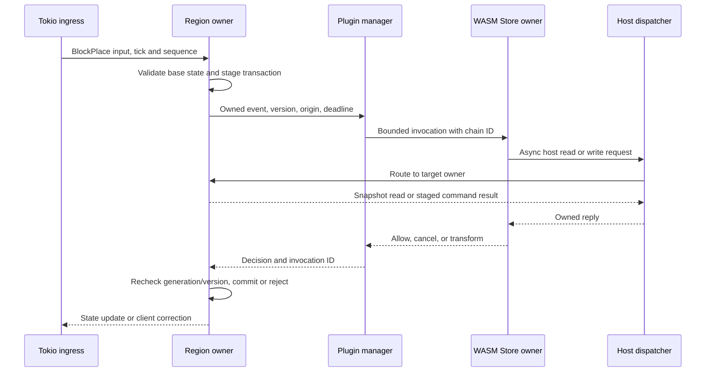

# Reactive plugin execution and host calls

**Status:** proposed architecture. Current-state statements refer to Pumpkin upstream at `4426d1113`. [Documentation index](../README.md) · [Overview](overview.md) · [Spatial ownership](spatial-ownership-and-ecs.md) · [Networking](networking.md) · [Phase 02](../phases/02-plugin-execution.md)

## Existing behavior and compatibility boundary

The [plugin manager](../../crates/pumpkin/src/plugin/mod.rs) loads native and WASM plugins and awaits registered handlers. Its `fire` path awaits both the mutable/blocking and immutable/nonblocking handler groups; the latter is not a detached notification pipeline. `fire_blocking` bridges synchronous callers into the asynchronous manager using `block_in_place` or a runtime `block_on`. The [WASM loader](../../crates/pumpkin/src/plugin/loader/wasm/mod.rs) owns the `LegacySyncReentry` admission policy, while the manager as a whole does not yet have one shared gate above native and WASM entrypoints. The [Store executor](../../crates/pumpkin-plugin-runtime/src/executor.rs) already has bounded channels and causal reentry behavior worth preserving.

The [movement handler](../../crates/pumpkin/src/net/java/play/player_position.rs) fires a cancellable `PlayerMoveEvent` before accepting state. [Block placement](../../crates/pumpkin/src/block/registry.rs) likewise waits for `BlockPlaceEvent` before mutation. A fire-and-forget rewrite would change these contracts. Upstream includes a [`pumpkin-scheduler` crate](../../crates/pumpkin-scheduler/src/lib.rs) with bounded Global admission and a [domain vocabulary](../../crates/pumpkin-scheduler/src/domain.rs), but the application does not yet use it and Region admission is not implemented. The upstream WASM host remains v0.1; an async v0.2 WIT and host are proposed work here.

Integrating upstream's Global scheduler as one fair, chain-aware v0.1 admission boundary above the full plugin manager is a proposed compatibility step, **not** current application behavior. It must cover native and WASM entrypoints and preserve existing Store reentry. Such a global boundary is itself a throughput bottleneck if every movement event crosses it. The longer-term contract must narrow admission by execution domain and plugin capability.

## Two explicit event classes

| Class | Examples | Contract | Overload behavior |
| --- | --- | --- | --- |
| **Decision** | Cancellable placement, movement, damage, or transform | The origin owner stages an authoritative transaction, submits an owned event snapshot, and applies a timely plugin result only after rechecking its owner generation and state version. | A per-event fail policy fires at a deadline. Late decisions cannot commit. Required ordering is preserved. |
| **Observation** | Post-commit telemetry, optional movement notification, metrics | An immutable event is published after commit. Subscriber declarations specify whether events may be batched or coalesced. | Bounded queue policy may replace or drop only events whose subscription contract permits it. |

The API must say which class each event uses. For a high-frequency `PlayerMoveEvent`, a plugin requiring an exact cancellable decision on every movement update stays on the decision path and consumes a measurable budget. A v0.2 observer subscription may opt into movement coalescing; it must not silently replace legacy cancellation semantics. For block placement, a deadline expiry may reject the pending placement and correct the client. Movement requires a separately documented last-accepted-position or fail policy, especially when a moderation plugin is present.

## Event lifecycle and causal routing



The origin actor parks the **transaction**, not a Rayon worker or a world lock. Its event snapshot owns all fields used after suspension. It can process unrelated messages while the decision is pending, but dependent operations must retain their order. A same-region host request must be serviced without recursively locking the region. Reads can use a committed snapshot plus the chain's staged overlay; writes are staged and ordered with the original transaction. Cross-region work uses owned request/reply messages, a target generation, hop limit, and deadline. A causal chain such as `A → host → B → host → A` must retain its chain token rather than reacquiring a global gate and deadlocking.

```rust
// Proposed shapes; not the current Pumpkin plugin API.
enum HookMode {
    Decision { deadline: Instant, on_timeout: FailPolicy },
    Observe { batching: BatchingPolicy },
}

struct Invocation {
    id: InvocationId,
    chain: ChainId,
    origin: ExecutionDomain,
    owner_generation: u64,
    source_revision: u64,
    mode: HookMode,
    event: Arc<EventSnapshot>,
}

struct HostRequest {
    invocation: InvocationId,
    target: ExecutionDomain,
    expected_generation: u64,
    command: OwnedHostCommand,
    reply: tokio::sync::oneshot::Sender<Result<OwnedHostReply, HostError>>,
}

async fn dispatch_host_call(
    req: HostRequest,
    directory: &OwnerDirectory,
) -> Result<(), HostError> {
    // Admission and deadline checks occur before sending to the target owner.
    // No Store lock, world guard, or OwnerToken crosses this await.
    let target = directory.resolve(req.target, req.expected_generation)?;
    target.send_with_deadline(req).await?;
    Ok(())
}
```

Each plugin has one logical Store owner unless its ABI explicitly supports multiple isolated instances or partitioned state. A Store owner need not imply a permanently pinned OS thread, but the selected Wasmtime API and `Send` requirements must be checked when implementing it. Parallel invocations of one shared Store are not assumed safe. The host dispatcher routes calls to Global, World, Region, or Entity owners as those domains become real; a global fallback keeps unmigrated APIs correct at the cost of parallelism.

## Budget and isolation model

Async WASM imports allow a guest to wait for host I/O without holding a host thread. They do **not** interrupt a guest tight loop, limit calls into expensive native host functions, or cap queue memory by themselves. The current WASM host applies an optional [linear-memory limit](../../crates/pumpkin/src/plugin/loader/wasm/wasm_host/mod.rs); inspected host/runtime configuration on this branch does not set a fuel or epoch execution budget.

Add the following limits as one policy enforced at invocation and host boundaries:

1. **Queue admission:** bounded Store, reentry, per-plugin event, and host-call queues with both item and byte weights. A full decision queue returns a defined timeout/failure result; an observation queue follows its subscription policy.
2. **Guest execution:** Wasmtime fuel for an absolute instruction budget and periodic async yielding, or epoch interruption for a coarser time slice. Configure a wall deadline as well. Fuel/epoch checks bound guest execution, while dedicated executor capacity prevents a guest from monopolizing Tokio reactor workers. [Wasmtime interruption guide](https://docs.wasmtime.dev/examples-interrupting-wasm.html), [async execution](https://docs.wasmtime.dev/api/wasmtime/#async).
3. **Host work:** maximum host-call count, decoded input size, result size, and in-flight calls per invocation. Every filesystem, HTTP, and game-state host function has its own cancellation and time budget. Guest fuel does not charge time spent inside arbitrary native host code.
4. **Store resources:** memory, table, and instance limits, plus compile cache and per-plugin aggregate memory accounting. An invocation cancellation prevents its late replies from mutating world state.
5. **Failure control:** a circuit breaker quarantines a repeatedly over-budget plugin and reports which event policy was applied. Restart/unload drains or rejects pending invocations deterministically.

The safe guarantee is precise: a WASM guest cannot hold a Tokio I/O worker or Rayon simulation worker **indefinitely** when these budgets and executor boundaries work. A cancellable gameplay action may still wait until its bounded deadline. Native plugins are outside the WASM sandbox; they require the same API discipline or process isolation before a blanket no-stall guarantee is valid.

## Verification contract

The [phase 02 plan](../phases/02-plugin-execution.md) covers integration. Tests must include an infinite-loop guest, host-call flood, 64-plus pending events, same-region read/write reentry, opposing root calls, `A → host → B → host → A`, plugin unload during a decision, timeout then late reply, and native plus WASM handler ordering. Measure p99 invocation wait, Store queue age, host queue age, guest CPU/fuel, timeout and trap rates, and impact on unrelated region ticks. Source-level runtime tests prove reentry logic; they do not alone prove end-to-end tick isolation.
