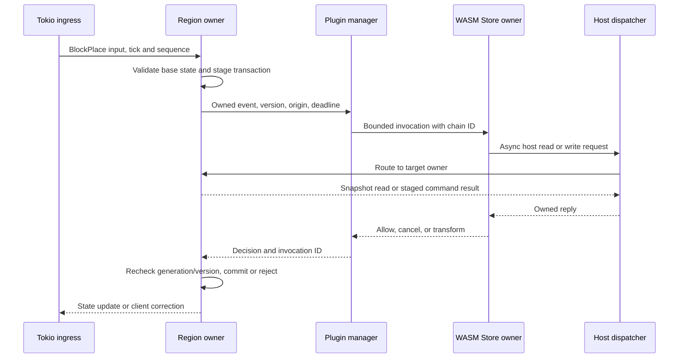

# Reactive plugin execution and host calls

Plugins participate in gameplay decisions, so their execution boundary has to protect the simulation without changing event semantics. This chapter describes a bounded, causal event pipeline against Pumpkin upstream revision `4426d1113`. The [system overview](overview.md) shows where it sits relative to [spatial ownership](spatial-ownership-and-ecs.md) and [networking](networking.md); [phase 02](../phases/02-plugin-execution.md) describes the implementation sequence. The proposed API and execution policy are not yet application behavior.

## Existing behavior and compatibility boundary

The [plugin manager](../../crates/pumpkin/src/plugin/mod.rs) loads native and WASM plugins, then awaits registered handlers. Its `fire` method awaits both the mutable/blocking and immutable/nonblocking handler groups. The second group therefore does not behave as a detached notification stream. Synchronous callers enter the asynchronous manager through `fire_blocking`, which uses `block_in_place` or a runtime `block_on`. The [WASM loader](../../crates/pumpkin/src/plugin/loader/wasm/mod.rs) applies a `LegacySyncReentry` admission policy, but the manager has no shared admission gate above native and WASM entrypoints. The [Store executor](../../crates/pumpkin-plugin-runtime/src/executor.rs) already provides bounded channels and causal reentry behavior that the new design should preserve.

The [movement handler](../../crates/pumpkin/src/net/java/play/player_position.rs) fires a cancellable `PlayerMoveEvent` before accepting a new position. [Block placement](../../crates/pumpkin/src/block/registry.rs) also awaits `BlockPlaceEvent` before mutating the world. These handlers need a result before commit, so routing them through a detached notification stream would change gameplay behavior. Upstream contains a [`pumpkin-scheduler` crate](../../crates/pumpkin-scheduler/src/lib.rs) with bounded Global admission and a [vocabulary of execution domains](../../crates/pumpkin-scheduler/src/domain.rs). The application does not yet use that crate, and Region admission is not implemented. The upstream WASM host remains v0.1; an asynchronous v0.2 WIT and host are proposed here.

One proposed compatibility step is to place upstream's Global scheduler above the entire plugin manager as a fair, chain-aware v0.1 admission boundary. That integration is **not** current application behavior. It would cover native and WASM entrypoints while preserving Store reentry. A single global gate would also serialize too much work if every movement event crossed it. Execution-domain routing and plugin capabilities must eventually narrow that gate without weakening the event contract.

## Two explicit event classes

| Class | Examples | Contract | Overload behavior |
| --- | --- | --- | --- |
| **Decision** | Placement, movement, damage, and transform events use this class when a plugin may cancel or change the action. | The origin owner stages an authoritative transaction and submits an owned event snapshot. It applies a timely result only after rechecking owner generation and state version. | The event's fail policy takes effect at its deadline. Late decisions cannot commit, and dependent operations retain their order. |
| **Observation** | Post-commit telemetry, optional movement notifications, and metrics use this class. | An immutable event is published after commit. Each subscription declares whether its events may be batched or coalesced. | A bounded queue may replace or drop an event only if that subscription explicitly permits it. |

Every event declaration specifies its class. A plugin that requires an exact cancellable decision for each `PlayerMoveEvent` remains on the decision path, with a measurable latency and CPU budget. A v0.2 observer subscription may explicitly choose coalesced movement notifications; it cannot silently replace legacy cancellation semantics. If a block-placement decision expires, the policy may reject the staged placement and correct the client. Movement needs its own documented failure behavior, such as retaining the last accepted position, particularly when moderation depends on the decision.

## Event lifecycle and causal routing



The origin actor suspends the **transaction** while the plugin works. It does not park a Rayon worker or hold a world lock. The event snapshot owns every field needed after suspension, allowing the actor to process unrelated messages. Operations that depend on the pending decision remain ordered behind it. A host call back into the same region must be serviced through the actor's message path rather than a recursive region lock. Reads may combine a committed snapshot with the invocation chain's staged overlay; writes join the staged transaction in order. Calls to another region carry an owned request and reply, target generation, hop limit, and deadline. A chain such as `A → host → B → host → A` retains the same chain token throughout reentry so it cannot deadlock while reacquiring a global gate.

```rust
// Proposed shapes; not the current Pumpkin plugin API.
enum HookMode {
    Decision { deadline: Instant, on_timeout: FailPolicy },
    Observe { batching: BatchingPolicy },
}

struct Invocation {
    id: InvocationId,
    chain: ChainId,
    origin: ExecutionDomain,
    owner_generation: u64,
    source_revision: u64,
    mode: HookMode,
    event: Arc<EventSnapshot>,
}

struct HostRequest {
    invocation: InvocationId,
    target: ExecutionDomain,
    expected_generation: u64,
    command: OwnedHostCommand,
    reply: tokio::sync::oneshot::Sender<Result<OwnedHostReply, HostError>>,
}

async fn dispatch_host_call(
    req: HostRequest,
    directory: &OwnerDirectory,
) -> Result<(), HostError> {
    // Admission and deadline checks occur before sending to the target owner.
    // No Store lock, world guard, or OwnerToken crosses this await.
    let target = directory.resolve(req.target, req.expected_generation)?;
    target.send_with_deadline(req).await?;
    Ok(())
}
```

Each plugin has one logical Store owner unless its ABI explicitly permits isolated instances or partitioned state. That owner does not necessarily require a permanently pinned OS thread; implementation depends on the selected Wasmtime API and its `Send` constraints. The design never assumes that parallel invocations against one shared Store are safe. The host dispatcher routes calls to Global, World, Region, or Entity owners as those domains become available. Unmigrated APIs can continue through a global fallback, with lower parallelism as the cost.

## Budget and isolation model

Asynchronous WASM imports let a guest wait for host I/O without occupying a host thread. They do **not** interrupt a tight guest loop, limit time spent in native host functions, or cap queued work. The current WASM host has an optional [linear-memory limit](../../crates/pumpkin/src/plugin/loader/wasm/wasm_host/mod.rs). The inspected host and runtime configuration does not establish a fuel or epoch execution budget. Resource isolation therefore needs several independent limits rather than an async import alone.

The invocation and host boundaries enforce the following limits as one policy:

1. **Queue admission** bounds Store, reentry, per-plugin event, and host-call queues by item count and bytes. When a decision queue is full, the caller receives the event's defined timeout or failure result; observation queues follow their subscriptions' declared policies.
2. **Guest execution** uses Wasmtime fuel for an instruction budget and periodic async yielding, or epoch interruption for a coarser time slice, together with a wall deadline. These checks bound guest execution, while dedicated executor capacity keeps it off Tokio reactor workers. See the [Wasmtime interruption guide](https://docs.wasmtime.dev/examples-interrupting-wasm.html) and [async execution API](https://docs.wasmtime.dev/api/wasmtime/#async).
3. **Host work** has per-invocation limits for call count, decoded input, result size, and in-flight calls. Filesystem, HTTP, and game-state functions also have their own cancellation and time budgets, because guest fuel does not account for arbitrary native host work.
4. **Store resources** have memory, table, and instance limits, backed by compile-cache and per-plugin aggregate memory accounting. Cancellation invalidates an invocation's late replies before they can mutate world state.
5. **Failure control** quarantines a plugin that repeatedly exceeds its budgets and reports the event policy used for its pending work. Restart or unload drains or rejects those invocations deterministically.

With these budgets and executor boundaries, a WASM guest cannot hold a Tokio I/O worker or Rayon simulation worker **indefinitely**. A cancellable action may still wait for its bounded decision deadline, so that latency remains part of the event's contract. Native plugins run outside the WASM sandbox and need the same API discipline or process isolation before the server can make a general no-stall claim.

## Verification contract

The [phase 02 plan](../phases/02-plugin-execution.md) covers integration and acceptance. Its tests exercise an infinite-loop guest, a host-call flood, at least 64 pending events, same-region read and write reentry, opposing root calls, the `A → host → B → host → A` chain, unload during a decision, a late reply after timeout, and mixed native/WASM handler ordering. Measurements include p99 invocation wait, Store and host queue age, guest CPU and fuel, timeout and trap rates, and the effect on unrelated region ticks. Runtime unit tests establish reentry behavior, while end-to-end load tests are still required to establish tick isolation.
