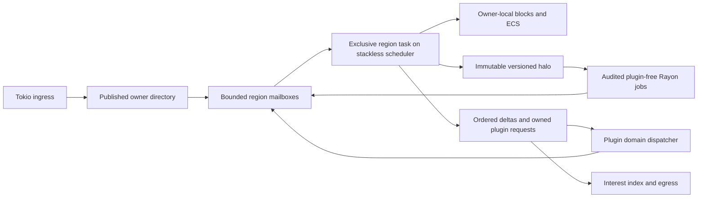

# Spatial ownership and entity layout

This document develops an ownership model for simulation and an entity layout that can take advantage of it. Descriptions of the current implementation refer to Pumpkin upstream at `4426d1113`. The owner directory, region actors, and ECS layout are proposed designs. The [overview](overview.md) places them in the wider architecture; [phase 3](../phases/03-region-ownership.md) and [phase 4](../phases/04-ecs-migration.md) describe their delivery. The [networking](networking.md), [plugin](plugin-pipeline.md), and [bottleneck](bottlenecks.md) documents cover the boundaries these systems must share.

## Why ownership is the next concurrency boundary

Pumpkin already uses Rayon. A dedicated [server ticker](../../crates/pumpkin/src/server/ticker.rs) invokes `Server::tick`; [world ticking](../../crates/pumpkin/src/server/mod.rs) distributes worlds, and [each world tick](../../crates/pumpkin/src/world/mod.rs) distributes player and entity work. The phases then rejoin before the server tick completes, so the slowest phase still determines its duration. Players and entities currently live in `ArcSwap<Vec<Arc<...>>>` collections. Frequently read entity fields are spread across trait objects, atomics, and locks, and collision work checks a tick-local player cache for each entity. The next concurrency boundary should address both the joined scheduling model and the layout of the data it schedules.

The proposed rule is that **each active spatial cell and entity has one mutable owner at a time**. A region groups cells that need same-tick interaction and acts as their logical owner. The smallest connected set of cells whose shared operations require that ordering is an *interaction island*. Its plugin-capable work runs as a managed stackless domain task, building on the Global-domain integration in [phase 02](../phases/02-plugin-execution.md). That task can await a plugin or another owner without occupying its scheduler worker. Adjacent regions read immutable border views and send mutations to the appropriate owner. Tokio remains responsible for network I/O and asynchronous coordination; Rayon runs bounded CPU leaves whose call graphs have been audited to exclude plugin entry. This division gives ECS batches a clear writer and removes the need for per-field atomics along much of the hot path.

[Folia's region logic](https://docs.papermc.io/folia/reference/region-logic/) is a useful comparison because it already merges nearby regions and splits independent ones. For Pumpkin, the proposed design also defines how subsystem jobs consume versioned snapshots, how plugins await decisions, and how replication observes committed changes. These boundaries matter when work leaves the owner: parallel execution is safe only if its inputs and commit rules are explicit. Tightly coupled gameplay operations will still have a serial portion.



### Ownership invariants

1. **Unique writer.** A chunk cell and entity have exactly one owner in each published ownership generation. Mutable world APIs require an owner token. Plugins, network tasks, and background Rayon jobs receive commands or snapshots instead of mutable world references.
2. **One authoritative turn in flight per region.** The scheduler admits one owner turn at a time. It can hand a finite, plugin-free snapshot computation to Rayon and await its owned result. A plugin-capable turn suspends as a managed future, with its mutable owner borrow released and its dependent transaction parked. Poll serialization alone does not make suspended multi-step work atomic; incoming commands still follow the owner's ordering rules.
3. **Versioned reads.** A neighbor publishes an immutable `Arc` snapshot of its border or collision halo, labeled with the source owner generation and committed tick. Each subsystem specifies the age it can tolerate. A mutation goes to the owner as a command, and any result that depends on a version is revalidated before commit.
4. **Ordered commit.** A region applies input and job outputs in a stable order such as `(target_tick, source_id, source_sequence)`. The commit step resolves conflicts because network arrival order alone does not define a deterministic order across sources.
5. **Bounded queues.** Each mailbox has item and byte budgets. Required gameplay commands receive an explicit overload response or upstream backpressure, while replaceable observations may be coalesced. Without a bound, a CPU hotspot can grow into a memory failure.
6. **Explicit cross-region semantics.** A strict multi-cell operation runs within one interaction island or a small transaction coordinated by its owners. Background results never mutate another owner's state directly. A subsystem that permits a one-tick delay at a border documents that timing contract.

Spatial ownership does not cover world time, weather, scoreboards, player data, or plugin global state. Each of these needs a named ownership domain so a region API does not conceal a world-sized write lock. Upstream's [`pumpkin-scheduler` domain scaffold](../../crates/pumpkin-scheduler/src/domain.rs) names Global, World, Region, Entity, and External, although only Global admission is documented and the scaffold is not integrated into the application. Domain tasks may interleave when they suspend. Serial task polls therefore provide **no transaction isolation** by themselves; the owner token, parked-transaction, and commit rules must accompany any scheduler integration.

### Rust shape of the owner boundary

The following is architectural pseudocode. Types such as `CellId` and `WorldCommand` are proposed and deliberately omit serialization and error details. The Rayon function is a plugin-free leaf; plugin decisions are dispatched by the surrounding managed domain task after releasing its owner borrow.

```rust
type RegionId = u64;
type CellId = u64;

struct DirectorySnapshot {
    epoch: u64,
    owner_by_cell: HashMap<CellId, RegionId>,
}

struct SpatialGrid {
    directory: arc_swap::ArcSwap<DirectorySnapshot>,
    endpoints: HashMap<RegionId, RegionEndpoint>,
}

struct RegionEndpoint {
    tx: tokio::sync::mpsc::Sender<RegionMsg>, // bounded
}

struct RegionState {
    epoch: u64,
    chunks: HashMap<ChunkPos, ChunkState>,
    entities: RegionEcs,
    pending_decisions: HashMap<DecisionId, PendingTransaction>,
}

struct OwnerToken<'a> {
    region: RegionId,
    state: &'a mut RegionState,
}

fn plan_plugin_free_batch(
    input: Vec<RegionMsg>,
    snapshot: Arc<RegionReadSnapshot>,
    halo: Arc<CollisionHalo>,
) -> Vec<WorldCommand> {
    plan_from_snapshot(input, &snapshot, &halo) // no plugin entry or await
}

fn commit_batch(state: &mut RegionState, mut commands: Vec<WorldCommand>) -> TickOutput {
    let mut owner = OwnerToken { region: state.region_id(), state };
    commands.sort_by_key(|c| (c.target_tick, c.source_id, c.sequence));
    owner.apply_validated(commands); // checks entity and ownership generations
    owner.take_output()
}
```

The managed region task snapshots the inputs for `plan_plugin_free_batch`, submits that bounded leaf to Rayon, and awaits its owned result. It then uses `OwnerToken` for the short commit step. If the turn emits a plugin invocation, the task records the pending transaction, releases the owner borrow, and awaits the plugin through [the dispatch boundary](plugin-pipeline.md); the result is version-checked before commit. Plugin entry from an unmanaged Rayon job is rejected or resubmitted through the scheduler. `ArcSwap` makes directory reads cheap and publishes new versions atomically; readers do not mutate a snapshot. Tokio `mpsc` bounds actor ingress. A small `RwLock` may still serve rare control-plane updates, provided world mutation does not depend on acquiring it.

### Rebalancing and handoff

The first partition can use configurable groups of chunks. Subsequent split and merge decisions should use measured region CPU time, mailbox age, entity count, and cross-boundary interaction rate. Hysteresis and a cooldown prevent a crowd near a threshold from repeatedly moving the same state. If players fight, collide, or exchange redstone across every candidate boundary, splitting the region may add more coordination than parallelism; those cells should remain an interaction island.

A safe migration protocol has five stages:

1. Select a target cutover tick and stop admitting new work under the old directory generation; route it into a bounded transfer buffer.
2. Let the old owner's in-flight tick finish. Cancel or version-fence stale AI, lighting, and generation results.
3. Transfer chunks, entities, scheduled ticks, pending plugin decisions, and ordered messages. Entity handles retain their external protocol identity while their internal locator changes.
4. Have the new owner acknowledge the complete state and publish a new directory snapshot and entity locator generation. Forward or reject late messages carrying the old generation.
5. Resume admission and verify that every transferred entity and required command appears exactly once. Keep a rollback path until the new owner is ready.

An empty neighboring chunk does not acquire a lock merely because an adjacent region is busy. Readers use the latest halo allowed by their subsystem's freshness contract, and writes enter the chunk owner's mailbox. Collision, lighting, fluid flow, and other border effects may need different maximum ages or same-tick ordering, so each subsystem must state its own rule.

## Owner-local ECS and parallel work

The ECS migration should begin with fields that are read or updated for most entities on most ticks. A region can keep transform, velocity, and hitbox values in sequential columns while leaving sparse inventory, AI memory, passenger relationships, and plugin-facing data in separate stores. This reduces pointer chasing without forcing every entity type into one large record. `EntityKey { slot, generation }` prevents a reused slot from accepting stale commands, and a locator maps the key to `(region, batch, row, owner_generation)`. Existing UUIDs and protocol entity IDs remain stable at external boundaries.

```rust
#[derive(Clone, Copy, Eq, PartialEq, Hash)]
struct EntityKey { slot: u32, generation: u32 }

struct MotionBatch {
    id: Vec<EntityKey>,
    x: Vec<f64>, y: Vec<f64>, z: Vec<f64>,
    vx: Vec<f64>, vy: Vec<f64>, vz: Vec<f64>,
    half_width: Vec<f32>, height: Vec<f32>,
}

struct RegionEcs {
    motion: Vec<MotionBatch>,
    // Sparse components and entity-type-specific data use other stores.
}

fn plan_motion(ecs: &mut RegionEcs, halo: &CollisionHalo) -> Vec<MotionIntent> {
    use rayon::prelude::*;
    ecs.motion.par_iter_mut()
        .map(|batch| plan_disjoint_batch(batch, halo))
        .collect::<Vec<Vec<MotionIntent>>>()
        .into_iter()
        .flatten()
        .collect()
}
```

`par_iter_mut` gives each worker a disjoint batch, which satisfies Rust's mutable aliasing rule. This function is eligible for Rayon only after its entire call graph is confirmed plugin-free. A worker may update independent fields directly or produce an intent from a stable snapshot. Inter-entity collision, combat, mounting, and cross-region movement instead produce intents for the owner to resolve in deterministic order. Structural changes such as spawn, despawn, and component moves occur at owner commit after parallel queries finish. Profiling should determine batch size; a task per entity would usually spend too much time on scheduling.

AI pathfinding, chunk generation, and lighting can run against snapshots if their results carry `(owner_generation, source_revision)` and the owner can reject or rebase stale work. These jobs need admission limits separate from simulation so a burst of chunk generation cannot consume every worker. [Pumpkin's current chunk scheduler](../../crates/pumpkin-world/src/chunk_system/schedule.rs) already has a bounded generation pool, which provides a behavior to preserve and measure. Some runtime lighting still runs inline during [world mutation](../../crates/pumpkin/src/world/mod.rs); moving it off-thread first requires a rule for when its result becomes visible.

## Dense hotspot behavior and hard limits

Consider a 500-player event within 3×3 chunks. The chunks with frequent shared interactions should remain together so those interactions keep their semantics. CPU reservations protect mandatory simulation, while independent AI, collision candidate construction, section lighting, and packet preparation can spread across workers. The [spatial interest index](networking.md) identifies observers. Intermediate movement updates can be coalesced against each recipient's last transmitted state, but spawn, despawn, inventory, and other required changes retain their order.

If all 500 players see the other 499 at 20 updates per second, the server schedules `500 × 499 × 20 = 4,990,000` recipient deliveries per second. At an illustrative 100 bytes per delivery, payload alone approaches 499 MB/s before encryption, framing, and other traffic. Neither work stealing nor ECS reduces that fanout or the serial portion of shared gameplay. Capacity claims must name the workload and update policy measured in [phase 5](../phases/05-capacity-validation.md).

## Measurements that decide the design

The evaluation needs region tick p50/p95/p99 and deadline misses, mandatory serial CPU, runnable Rayon time versus wait, mailbox age and bytes, cross-owner message rate, migration duration, snapshot bytes and age, stale-result rejection, ECS rows moved, collision candidates per entity, cache misses, and player-visible update staleness. A split succeeds only when it improves throughput or isolation after transfer and cross-border costs are included. A region size that performs well only in an empty world is not enough evidence to set a production default.
