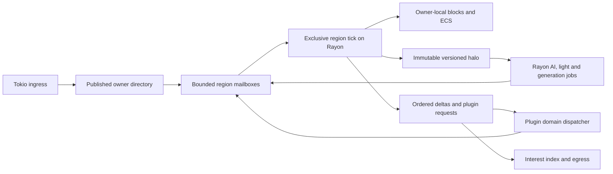

# Spatial ownership and entity layout

**Status:** proposed architecture. Current-state observations refer to Pumpkin upstream at `4426d1113`; the owner directory, region actors, and ECS layout are designs, not implemented features. See the [architecture overview](overview.md), [networking](networking.md), [plugin pipeline](plugin-pipeline.md), and [bottleneck matrix](bottlenecks.md). The delivery work is in [phase 3](../phases/03-region-ownership.md) and [phase 4](../phases/04-ecs-migration.md).

## Why ownership is the next concurrency boundary

Pumpkin already uses Rayon. A dedicated [server ticker](../../crates/pumpkin/src/server/ticker.rs) invokes `Server::tick`; [world ticking](../../crates/pumpkin/src/server/mod.rs) parallelizes worlds, and [each world tick](../../crates/pumpkin/src/world/mod.rs) parallelizes player and entity work. Those phases rejoin before the server tick completes. The current world stores players and entities as `ArcSwap<Vec<Arc<...>>>`; hot entity fields are spread among trait objects, atomics, and locks. The tick also builds a player cache and checks it for each ticked entity's player collisions. This is useful concurrency today, but a busy world or expensive phase can still determine the duration of the joined tick.

The proposed boundary is **one mutable owner for each active spatial cell and each entity at a time**. A region is a dynamic group of cells whose interactions require the same owner. It is a logical actor with an ordered mailbox, not a permanently assigned OS thread or a lock around a fixed set of chunks. Adjacent regions exchange immutable views and owner-routed commands. Tokio handles network I/O, deadlines, and scheduling; bounded Rayon work handles CPU simulation. Region ownership supplies the write-safety rule that allows later ECS batches to avoid atomics for most hot fields.

Folia is a relevant point of comparison: it already **merges nearby regions and splits independent regions**, so it should not be characterized as only rigid chunk locks. The additional Pumpkin proposal is to make subsystem jobs inside an ownership domain explicit, use versioned snapshots for their inputs, and connect region ownership to the plugin and replication contracts. Neither design makes tightly coupled gameplay operations automatically parallel. See [PaperMC's region logic](https://docs.papermc.io/folia/reference/region-logic/).



### Ownership invariants

1. **Unique writer.** A chunk cell and entity have exactly one owner at a published ownership generation. Mutable world APIs require an owner token; no ordinary plugin, network task, or Rayon job receives a mutable world reference.
2. **One tick in flight per region.** The actor transfers its `RegionState` to a bounded Rayon task for a synchronous simulation step. It queues incoming messages while that step runs and regains the state with the result. Moving the state container does not copy its component arrays. Rayon jobs never wait on Tokio futures or hold a region guard across `.await`.
3. **Versioned reads.** A neighbor's border or collision halo is an immutable `Arc` snapshot labeled with the source owner generation and committed tick. Reads can tolerate a documented age; mutations must be commands to the owner. Version-sensitive results are revalidated before commit.
4. **Ordered commit.** A region applies input and job outputs in a stable order such as `(target_tick, source_id, source_sequence)`. Conflict resolution occurs at this commit point. Network arrival order alone is not a deterministic cross-source order.
5. **Bounded queues.** Each mailbox has item and byte budgets. Required gameplay commands have an explicit overload response or upstream backpressure; replaceable observations can be coalesced. An unbounded mailbox would convert a CPU hotspot into a memory failure.
6. **Explicit cross-region semantics.** A strict multi-cell operation is executed by one interaction island or a small owner-coordinated transaction. A background snapshot result never silently changes another owner's state. Operations allowed a one-tick border delay must state that contract.

World time, weather, scoreboards, player data, and plugin global state need named ownership domains as well. They must not become a new world-sized write lock hidden behind the region API. Upstream's [`pumpkin-scheduler` domain scaffold](../../crates/pumpkin-scheduler/src/domain.rs) already names Global, World, Region, Entity, and External, but documents only Global admission and is not integrated into the application. It also says domain tasks may interleave when they suspend: serial task polls are **not transaction isolation**. Extending that scheduler must therefore be paired with the explicit owner token, parked-transaction, and commit rules above.

### Rust shape of the owner boundary

The following is architectural pseudocode. Types such as `CellId` and `WorldCommand` are proposed and deliberately omit serialization and error details.

```rust
type RegionId = u64;
type CellId = u64;

struct DirectorySnapshot {
    epoch: u64,
    owner_by_cell: HashMap<CellId, RegionId>,
}

struct SpatialGrid {
    directory: arc_swap::ArcSwap<DirectorySnapshot>,
    endpoints: HashMap<RegionId, RegionEndpoint>,
}

struct RegionEndpoint {
    tx: tokio::sync::mpsc::Sender<RegionMsg>, // bounded
}

struct RegionState {
    epoch: u64,
    chunks: HashMap<ChunkPos, ChunkState>,
    entities: RegionEcs,
    pending_decisions: HashMap<DecisionId, PendingTransaction>,
}

struct OwnerToken<'a> {
    region: RegionId,
    state: &'a mut RegionState,
}

fn simulate_tick(
    mut state: Box<RegionState>,
    input: Vec<RegionMsg>,
    halo: Arc<CollisionHalo>,
) -> (Box<RegionState>, TickOutput) {
    let mut owner = OwnerToken { region: state.region_id(), state: &mut state };
    let mut commands = plan_and_simulate(&mut owner, input, &halo);
    commands.sort_by_key(|c| (c.target_tick, c.source_id, c.sequence));
    owner.apply_validated(commands); // checks entity and ownership generations
    let output = owner.take_output();
    drop(owner); // end the mutable borrow before moving state back to the actor
    (state, output)
}
```

An actor may submit `simulate_tick` to Rayon with a oneshot reply after taking its `Box<RegionState>` out of its slot. It cannot submit a second tick until that reply returns. The directory uses `ArcSwap` for frequent reads and infrequent atomic publication, not to permit readers to mutate the underlying state. Tokio `mpsc` gives bounded actor ingress; a small `RwLock` is acceptable for rare control-plane changes, never as the hot world mutation path.

### Rebalancing and handoff

Start with cells based on a configurable group of chunks, then split or merge based on measured region CPU time, mailbox age, entity count, and cross-boundary interaction rate. Use hysteresis and a cooldown. Splitting a region whose players fight, collide, or exchange redstone across every candidate boundary may increase work; such cells remain an interaction island.

A safe migration protocol has five stages:

1. Select a target cutover tick and stop admitting new work under the old directory generation; route it into a bounded transfer buffer.
2. Let the old owner's in-flight tick finish. Cancel or version-fence stale AI, lighting, and generation results.
3. Transfer chunks, entities, scheduled ticks, pending plugin decisions, and ordered messages. Entity handles retain their external protocol identity while their internal locator changes.
4. Have the new owner acknowledge the complete state and publish a new directory snapshot and entity locator generation. Forward or reject late messages carrying the old generation.
5. Resume admission and verify that every transferred entity and required command appears exactly once. Keep a rollback path until the new owner is ready.

Neighboring empty chunks need no lock because a busy region exists nearby. A read uses the latest permitted immutable halo; a write enters the correct owner's mailbox. The halo's maximum age, boundary effects, and whether a particular operation requires same-tick ordering must be specified by subsystem.

## Owner-local ECS and parallel work

The ECS pilot should move only hot, frequently iterated data first. A region keeps sequential transform, velocity, and hitbox columns in batches; sparse inventory, AI memory, passenger relationships, and plugin-facing data can remain separate. `EntityKey { slot, generation }` prevents a reused slot from accepting stale commands. A locator maps the key to `(region, batch, row, owner_generation)`. Existing UUID and protocol entity IDs remain stable at external boundaries.

```rust
#[derive(Clone, Copy, Eq, PartialEq, Hash)]
struct EntityKey { slot: u32, generation: u32 }

struct MotionBatch {
    id: Vec<EntityKey>,
    x: Vec<f64>, y: Vec<f64>, z: Vec<f64>,
    vx: Vec<f64>, vy: Vec<f64>, vz: Vec<f64>,
    half_width: Vec<f32>, height: Vec<f32>,
}

struct RegionEcs {
    motion: Vec<MotionBatch>,
    // Sparse components and entity-type-specific data use other stores.
}

fn plan_motion(ecs: &mut RegionEcs, halo: &CollisionHalo) -> Vec<MotionIntent> {
    use rayon::prelude::*;
    ecs.motion.par_iter_mut()
        .map(|batch| plan_disjoint_batch(batch, halo))
        .collect::<Vec<Vec<MotionIntent>>>()
        .into_iter()
        .flatten()
        .collect()
}
```

Each `par_iter_mut` worker receives a disjoint batch, satisfying Rust's mutable aliasing rule. The worker may update fields whose behavior is independent, or produce an intent from a stable snapshot. Inter-entity collision, combat, mounting, and cross-region movement produce intents that the owner resolves in deterministic order; direct concurrent writes to both participants are forbidden. Structural changes, including spawn/despawn and component moves, occur at owner commit after parallel queries finish. Batch sizes should be chosen from profiling, not fixed at one entity per task.

AI pathfinding, chunk generation, and lighting are good snapshot jobs when they carry `(owner_generation, source_revision)` and the owner can reject or rebase stale results. They need separate admission limits so a generation burst cannot fill every simulation worker. [Pumpkin's current chunk scheduler](../../crates/pumpkin-world/src/chunk_system/schedule.rs) already has a bounded generation pool; this is a base to preserve and measure. Some runtime lighting work in [world mutation](../../crates/pumpkin/src/world/mod.rs) is inline today and would need a correctness-preserving publication rule before offloading.

## Dense hotspot behavior and hard limits

For a 500-player event in a 3×3-chunk area, keep strongly interacting chunks together and reserve CPU for mandatory simulation. Parallelize independent AI, collision broad-phase candidate construction, section lighting, and packet preparation. Use the [spatial interest index](networking.md) to find observers; coalesce intermediate, replaceable movement against each recipient's last transmitted state. Preserve ordered spawn, despawn, inventory, and other required changes.

If all 500 players can see all other 499 at 20 updates per second, there are `500 × 499 × 20 = 4,990,000` recipient deliveries per second. At an illustrative 100 bytes per delivery, payload alone is about 499 MB/s before encryption, framing, or other traffic. Work stealing and ECS do not remove this fanout or the serial part of shared gameplay. The performance claim must therefore be scoped to the measured workload and update policy in [phase 5](../phases/05-capacity-validation.md).

## Measurements that decide the design

Record region tick p50/p95/p99 and deadline misses, mandatory serial CPU, runnable Rayon time versus wait, mailbox age and bytes, cross-owner message rate, migration duration, snapshot bytes and age, stale-result rejection, ECS rows moved, collision candidates per entity, cache misses, and player-visible update staleness. A successful split improves throughput or isolation **after** its transfer and cross-border cost. No region-size constant should be accepted solely because it performs well in an empty world.
